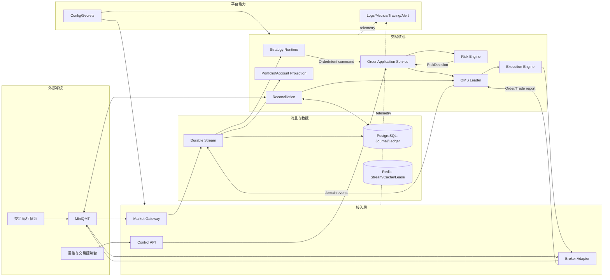
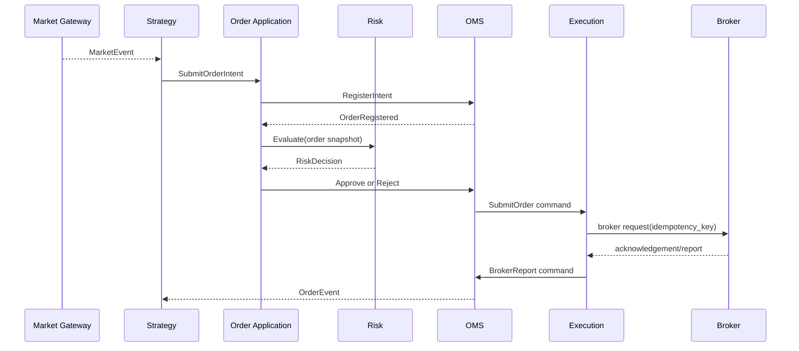

# 系统架构

> Status: Proposed

## 整体架构图

## 唯一交易链路

先注册意图再风控，确保被拒订单同样可审计。只有 OMS 可以推进订单状态；Risk 不修改订单，Execution 不解释业务状态。

## 部署单元

- Market Process：QMT 行情回调、标准化、去重、时间戳和发布。
- Strategy Worker：按策略或策略组隔离计算；崩溃不影响交易核心。
- Trading Core：Order Application、Risk、OMS Leader、Execution；优先保证确定性。
- Broker Process：隔离 MiniQMT SDK 故障和回调线程。
- Projection/Storage Worker：持久化、账户持仓投影、报表。
- Control/Observability：控制面、指标、告警，不参与下单数据面。

Redis/Stream 故障时不能切换到“绕过消息系统直接下单”。交易核心根据故障矩阵进入 Degraded 或 Safe Mode。
