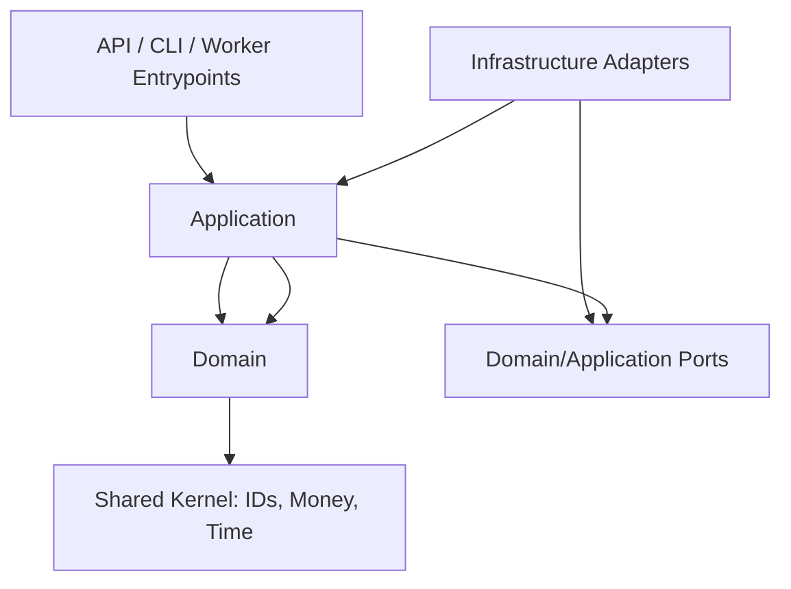
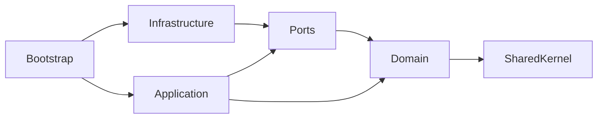

# 领域边界与分层

> Status: Proposed

## 限界上下文

| 上下文 | 所有权 | 不负责 |
|---|---|---|
| Market Data | 标准行情、质量、订阅、Bar 聚合 | 策略判断 |
| Strategy | 策略状态、信号和交易意图 | 风控、订单状态 |
| Risk | 规则、限额、风险快照和决策 | 创建/修改订单 |
| Order Management | 订单聚合、状态机、幂等、归属 | Broker SDK 细节 |
| Execution | 路由、拆单计划、Broker 命令 | 订单业务事实所有权 |
| Portfolio | 成交驱动的持仓、PnL 投影 | 擅自修正 Broker 事实 |
| Account/Ledger | 现金、冻结、费用和账本 | 策略逻辑 |
| Reconciliation | 外部与内部事实比对、差异工单 | 静默覆盖历史 |
| Operations | 配置、控制命令、审计、健康状态 | 交易决策 |

## 分层

### Domain

纯 Python 领域模型，包括聚合、值对象、领域服务、状态机和领域事件。不得导入 Redis、PostgreSQL、QMT、Web 框架或系统时钟。

### Application

编排用例、命令、查询、事务边界、权限和 Port。它决定“按什么顺序做”，但不包含 Broker 适配或 SQL。

### Infrastructure

实现 Broker、Stream、Repository、Clock、Scheduler、Telemetry 和配置 Port。负责协议转换、超时、连接与错误翻译，不包含交易规则。

## 依赖规则

- 组合根是唯一知道具体 Adapter 的位置。
- Context 间不能直接修改对方聚合，通过 Application Port 或已发布事件协作。
- 查询模型可以跨上下文组合；写模型不能跨聚合共享数据库事务。
- 订单聚合以 `order_id + version` 实现乐观并发控制。
