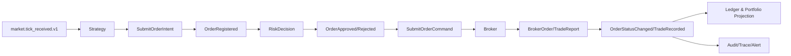

# 事件架构

> Status: Proposed

核心消息字段定义见 [Message-Contracts.md](Message-Contracts.md)。该文件与本文共同构成消息实现契约。

## 消息分类

| 类型 | 用途 | 示例 | 处理语义 |
|---|---|---|---|
| Command | 指定所有者执行动作 | `SubmitOrderIntent` | 单一消费者、明确结果 |
| Domain Event | 聚合内已发生事实 | `OrderApproved` | 与聚合提交原子记录 |
| Integration Event | 跨进程传播事实 | `OrderStatusChangedV1` | At-Least-Once |
| Query | 读取状态 | `GetAccountSnapshot` | 不改变状态 |
| Control | 运维控制 | `EnterSafeMode` | 鉴权、审计、幂等 |

“事件优先”不等于“禁止函数调用”。同进程纯计算使用直接调用；跨边界事实传播使用事件；需要结果的动作使用 Command。

## 统一信封

```text
message_id        全局唯一
message_type      稳定名称
schema_version    正整数
occurred_at       来源发生时间，UTC
received_at       本系统接收时间，UTC
correlation_id    一笔交易链路
causation_id      直接前因消息
aggregate_id      可选
aggregate_version 可选，防乱序
source            生产组件实例
partition_key     顺序键，订单事件使用 order_id
payload           版本化数据
```

领域事件不可变。修正错误必须追加补偿事实，不能修改历史事件。

## 投递与一致性

- PostgreSQL 中聚合变更与 Outbox 同事务提交。
- Publisher 从 Outbox 发布，确认后标记；失败重试会产生重复投递。
- Consumer 使用 `message_id` Inbox 去重，并以聚合版本拒绝过期事件。
- 不承诺全局顺序；只保证同一 partition_key 的局部顺序。
- Redis Stream 用于低延迟分发和短期回放，不作为永久审计账本。

## 背压与队列

所有队列必须配置容量、告警水位和满载动作：行情允许合并同一标的过期快照但不可伪造逐笔；订单/成交消息禁止丢弃，队列满时停止接受新订单意图并进入 Degraded Mode。

## 回放

回放必须指定事件范围、schema 版本、目标隔离命名空间和副作用策略。默认禁止回放触发真实 Broker Adapter。投影支持从 checkpoint 重建；订单命令不可通过普通事件回放重复发送。

## 事件流


