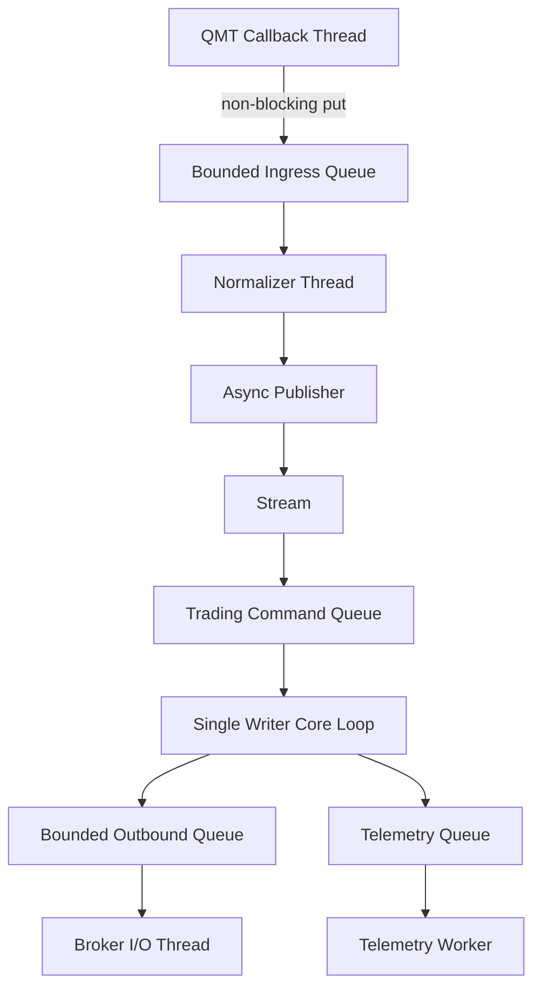
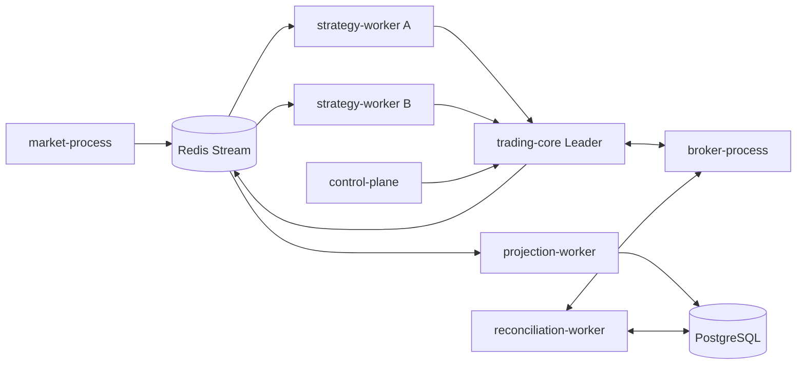

# 并发、线程与进程模型

> Status: Proposed

工作负载、延迟预算和压测准入条件见 [Capacity-And-Performance.md](Capacity-And-Performance.md)。

## 原则

- Broker 回调只做校验、标准化最小字段和有界入队，不做业务计算。
- 每个可变聚合只有一个逻辑写入者；用消息串行化降低锁复杂度。
- I/O 与 CPU 工作分离；不能假设 asyncio 会加速 CPU 密集策略。
- 线程间只传不可变 DTO；进程间只传版本化消息。

## 线程模型

Trading Core 默认单线程推进订单状态；耗时风控模型可在只读快照上并行计算，但结果必须带 snapshot_version，过期结果不得提交。

## 进程模型

第一阶段允许 Trading Core 内部模块同进程部署以降低延迟，但边界保持可拆分。多实例部署时只有持有效 lease 与 fencing token 的 Leader 可向 Broker 发命令。

## 调度器与时间

- Domain 只依赖 `Clock`；Live 使用校准系统时钟，Backtest 使用 VirtualClock。
- 定时任务具有稳定 job_id、misfire 策略和幂等语义。
- 交易日历、午休、集合竞价、日切由 SessionScheduler 管理，禁止各策略自行判断。
- 同时记录 event time、receive time 和 processing time；不得使用本地时间字符串作为排序依据。

## 队列策略

| 队列 | 满载动作 |
|---|---|
| 原始行情 | 快照行情可按标的保留最新；逐笔行情落盘或触发数据质量故障 |
| 策略输入 | 暂停策略并标记 stale，不基于过期行情继续下单 |
| 交易命令 | 拒绝新意图；撤单和 Kill Switch 使用保留容量 |
| Broker 回报 | 不可丢弃；本地 spool 后重试并触发严重告警 |
| Telemetry | 指标可聚合，审计日志不可丢弃 |
