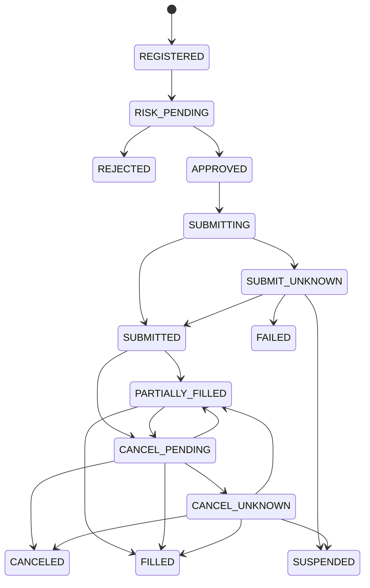
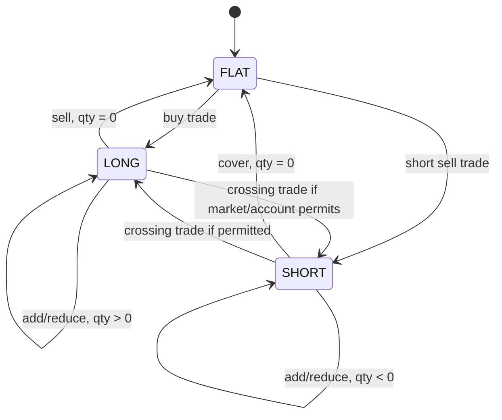
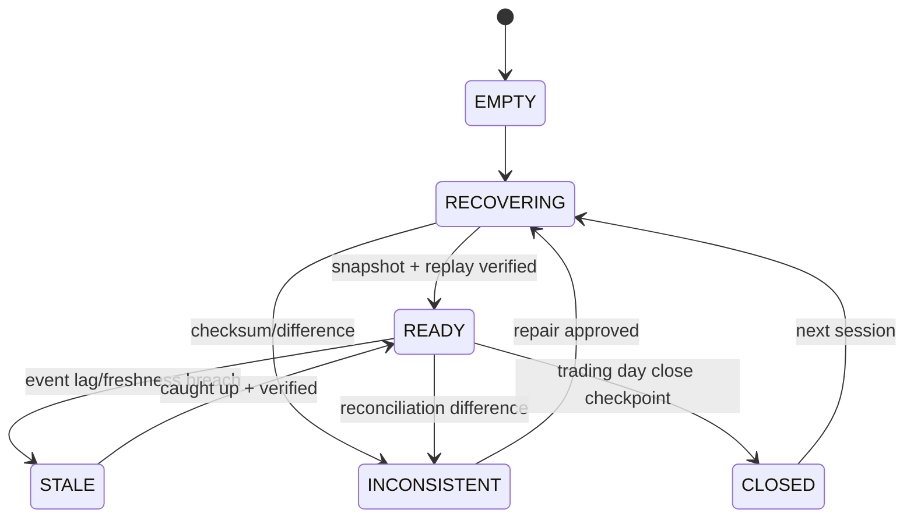
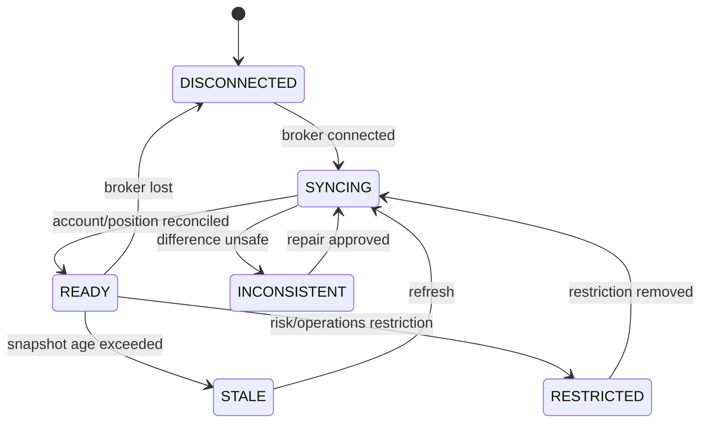
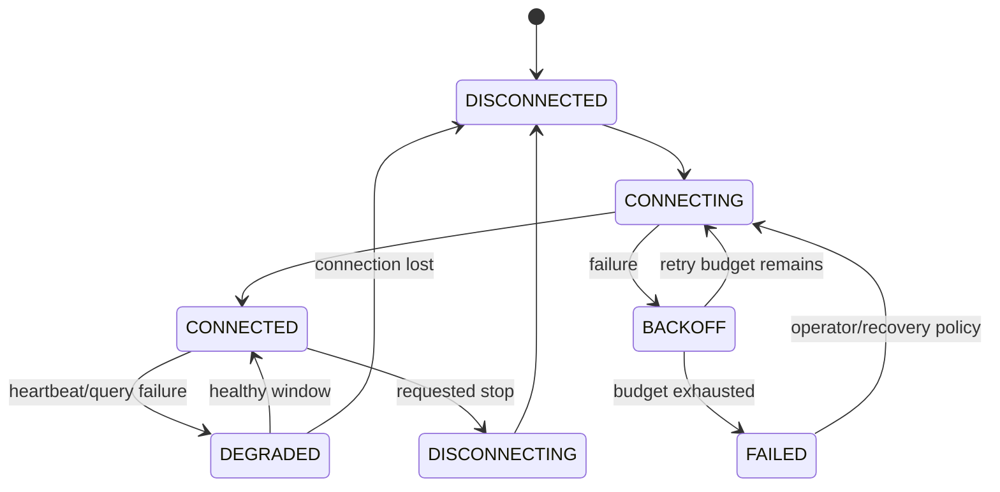
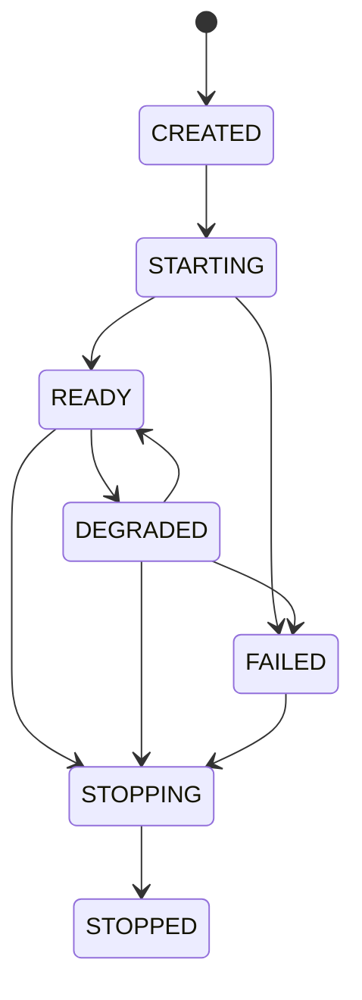
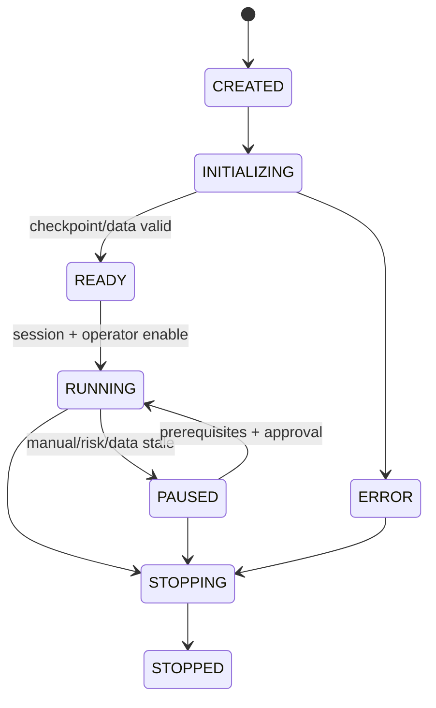
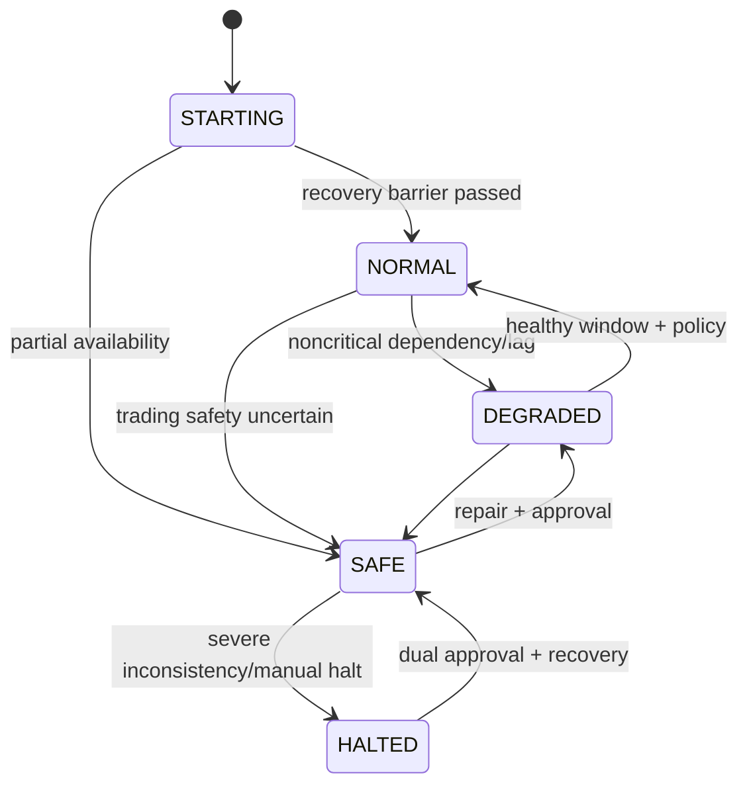
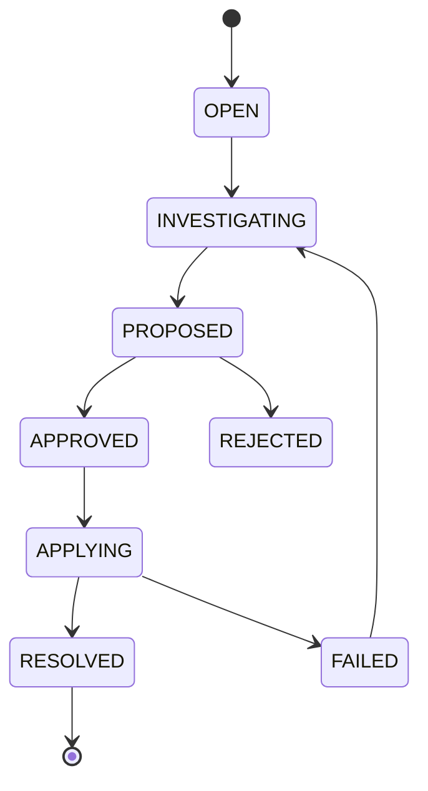

# State Machine Catalog

> Status: Proposed  
> 业务代码不得直接赋值状态；必须通过有 Guard 的 transition，并生成状态变化事件。详细订单迁移表见 [OMS-And-Risk-Specification.md](OMS-And-Risk-Specification.md)。

## Order

## Position（净持仓账户）

Position 的权威数据是数量和账本事实，状态只是派生值。禁止单独持久化一个可能与 quantity 冲突的 status。对冲模式账户应使用独立 long/short lot 聚合，不套用净持仓跨零规则。

## Portfolio Projection

只有 READY 投影可用于扩大风险敞口的风控决策。

## Account

## Broker Connection

## Gateway Lifecycle

Connection 是外部会话状态，Gateway 是组件生命周期；两者不能混成一个枚举。

## Strategy

暂停策略不取消其已有订单所有权；OMS 继续管理活动订单。恢复 RUNNING 前检查行情、账户、组合和配置版本。

## System Trading Mode

NORMAL 允许策略新单；DEGRADED 按范围限制；SAFE 禁止扩大风险但保留查询、撤单和经规则批准的减仓；HALTED 仅允许恢复控制命令。

## Reconciliation Case

每次迁移记录 operator、reason、evidence、approval 和版本。P0/P1 case 不能自动从 OPEN 直接 RESOLVED。
