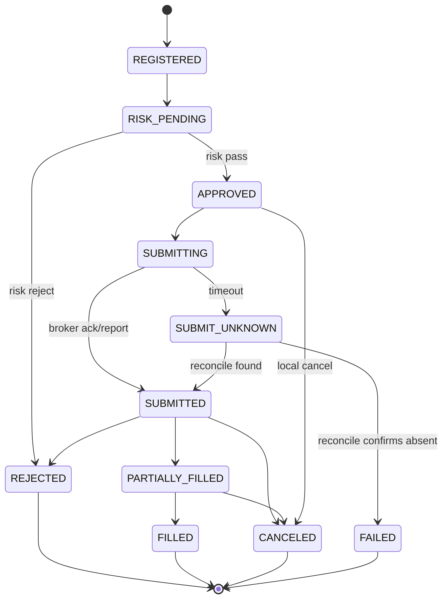

# 交易核心设计

> Status: Proposed

订单迁移、乱序处理和风控规则的规范性定义见 [OMS-And-Risk-Specification.md](OMS-And-Risk-Specification.md)。本文状态图仅用于总览。

## 组件职责

| 组件 | 输入 | 输出 | 核心约束 |
|---|---|---|---|
| Market Gateway | 原始行情 | 标准 MarketEvent | 去重、质量标记、不做策略 |
| Strategy Runtime | 行情与订单事件 | OrderIntent | 无 Broker 权限 |
| Order Application | OrderIntent | 编排命令 | 固定交易顺序 |
| Risk Engine | 不可变风险快照 | RiskDecision | 纯决策、规则版本化 |
| OMS | 命令与 Broker 报告 | Order Event | 订单唯一写入者 |
| Execution | 已批准订单 | Broker Command | 路由、限速、幂等 |
| Portfolio/Account | Trade/Ledger Event | 只读投影 | 不反向修改订单 |
| Reconciliation | Broker 与本地快照 | Difference/Repair Command | 禁止静默覆盖 |

## 风控链路

风险检查至少分为：输入合法性、交易时段、标的白名单、价格/数量边界、可用资金和持仓、单笔限额、策略限额、账户限额、组合暴露、频率/撤单率及全局 Kill Switch。每次决策记录 rule_set_version、输入快照版本、逐规则结果和耗时。

状态不新鲜、账户基线未对齐或关键规则超时时采用 fail-closed；仅监控类规则可配置 fail-open，且必须告警。

## 订单状态机

超时不是失败。`SUBMIT_UNKNOWN` 状态禁止自动以新 client_order_id 重发，必须先查询 Broker 或使用 Broker 支持的幂等标识。

## 标识与所有权

- `intent_id`：一次策略意图。
- `order_id`：OMS 内部稳定 ID。
- `client_order_id`：发送给 Broker 的幂等关联 ID。
- `broker_order_id`：Broker 返回 ID，建立唯一映射。
- `trade_id`：Broker 成交 ID；以 `(broker, account, trading_day, trade_id)` 去重。

## 账务语义

成交是订单、持仓和资金变化的连接事实。Portfolio 是成交事件的投影；Account Ledger 采用追加式分录记录现金、冻结、费用和调整。Broker 持仓资金是外部核对基准，不得直接覆盖内部历史；差异通过调整分录和审计工单处理。

## 安全模式

`NORMAL → DEGRADED → SAFE → HALTED`。SAFE 模式拒绝新开仓，保留查询、撤单和人工减仓能力；HALTED 只允许经过双重确认的恢复动作。模式变化本身是持久化、可审计事件。
