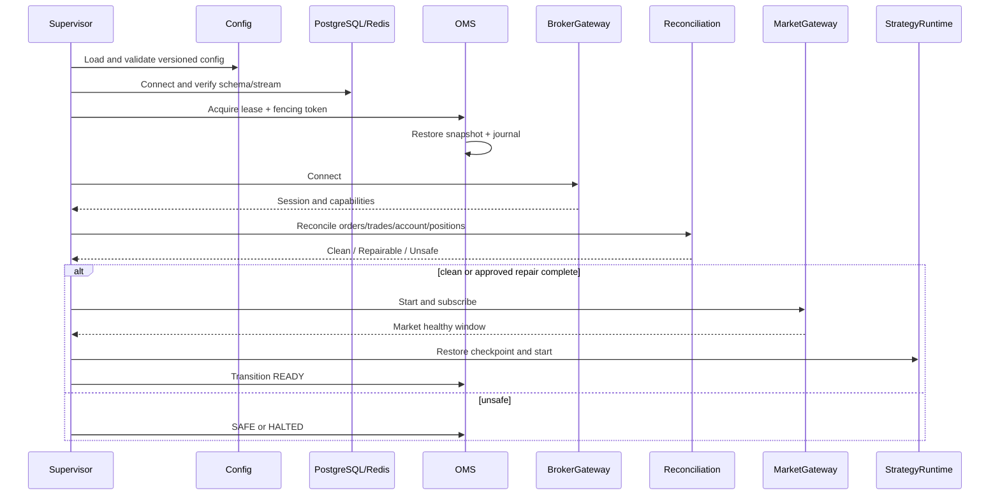
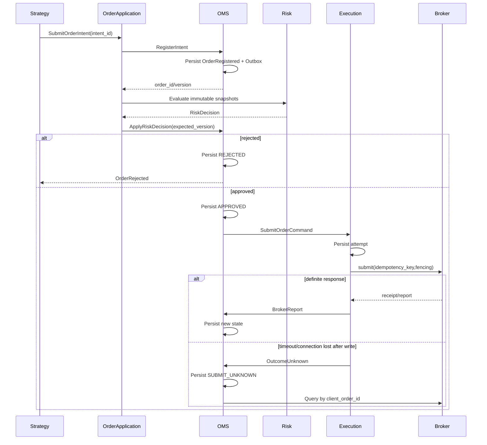
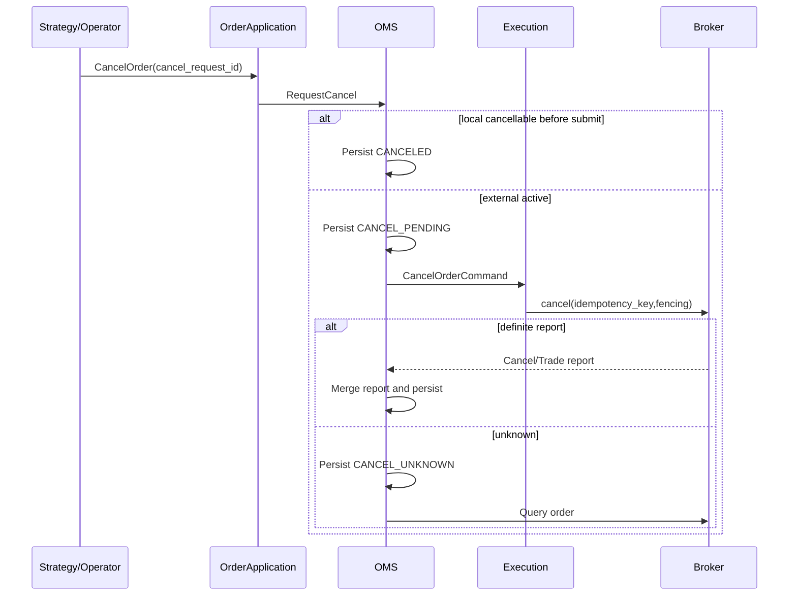
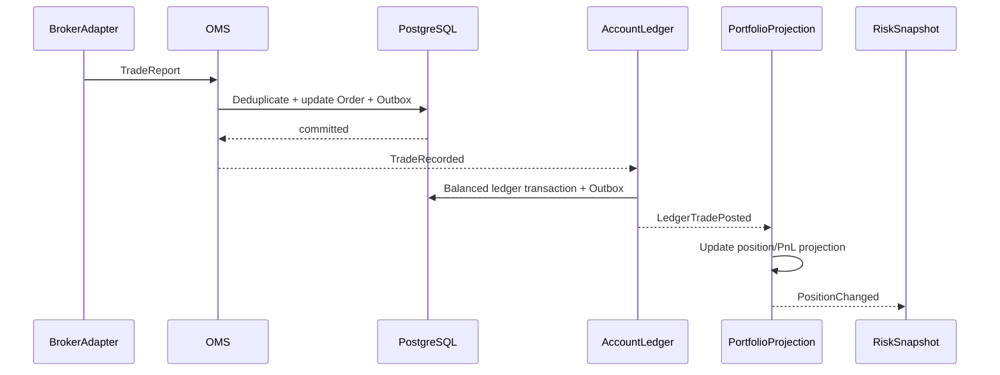
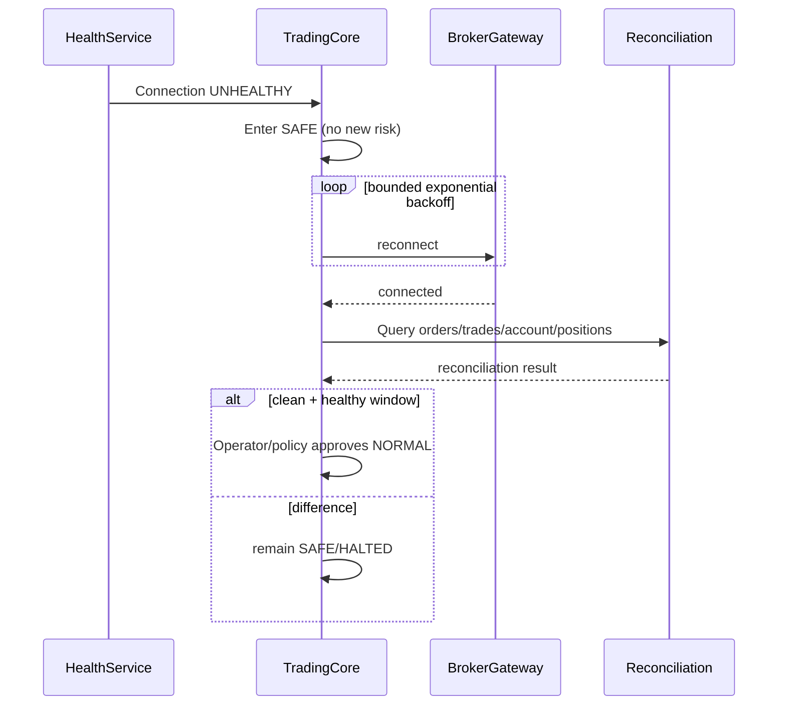
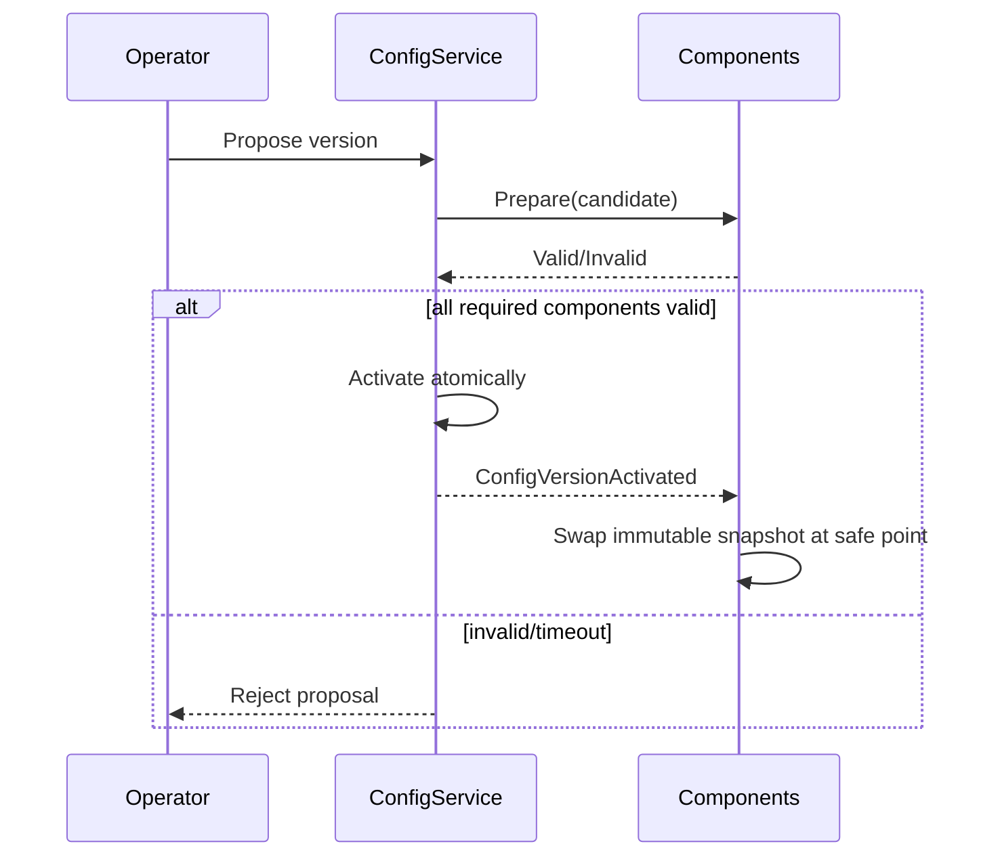

# Workflow Catalog

> Status: Proposed  
> 本文定义核心流程的唯一顺序。每个步骤必须记录 correlation_id；省略的日志、指标和 Outbox 不代表可以省略实现。

## 系统启动与 Ready

任何依赖失败都不能跳过恢复屏障。重试受总预算限制；预算耗尽保持进程可诊断并进入 DEGRADED/SAFE，而不是退出重启风暴。

## Submit Order

步骤超时：注册 DB 超时不外发；Risk 超时 fail-closed；Broker 超时进入 UNKNOWN；事件发布失败由 Outbox 重试，不回滚已经提交的业务事实。

## Cancel Order

撤单期间仍可能成交，TradeReport 优先作为事实处理。重复 cancel_request_id 返回同一结果。

## Trade and Accounting

任何下游失败由各自 Inbox 重放，不允许回滚 Broker 已发生的成交。Ledger 不平衡时消息进入隔离队列并触发 P0。

## Broker Disconnect and Reconnect

重连成功不自动恢复交易；必须完成对账、健康窗口和恢复审批。

## 配置热更新

## 通用失败策略

| 失败类型 | Retry | 状态 | 恢复 |
|---|---|---|---|
| 参数/业务拒绝 | No | 明确终态/保持原态 | 修正新请求 |
| 乐观锁冲突 | 重新读取后有限重试 | 不丢失原状态 | 单写者重新编排 |
| 幂等 I/O 短暂失败 | 有预算退避 | DEGRADED | 健康探测 |
| Broker 外部动作结果未知 | 禁止盲重试 | UNKNOWN | Query + Reconcile |
| 持久化不可用 | 不接受新风险动作 | SAFE | 验证写入和 Outbox |
| 数据差异/非法迁移 | No | SUSPENDED/HALTED | 工单与审计修复 |
