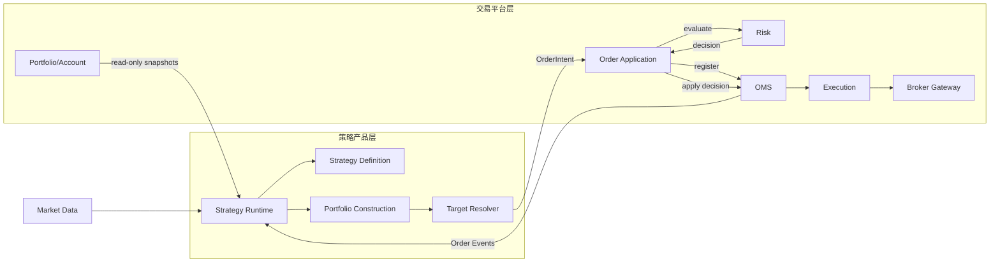
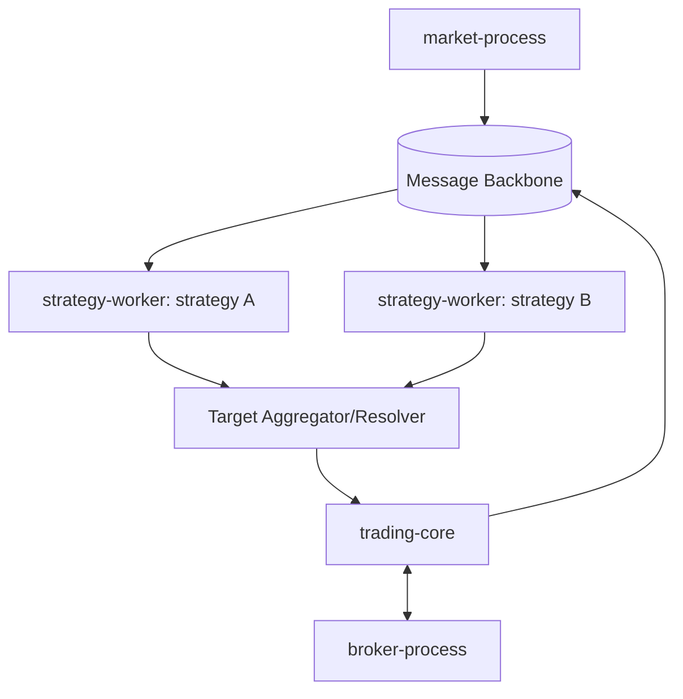

# 策略产品层与交易平台层

> Status: Proposed

## 决策

QuantiQmt 采用一个仓库、两个逻辑产品层、多个隔离进程。第一阶段不拆独立仓库；边界先通过包依赖、接口权限、进程和发布物隔离。



## 职责

| 策略产品层 | 交易平台层 |
|---|---|
| 买什么、何时买卖 | 是否允许交易 |
| 目标数量/目标权重 | 订单注册与状态一致性 |
| 参数、信号、组合构建 | 资金、仓位和统一风控 |
| 策略 checkpoint | Broker 路由、限速、成交处理 |
| 策略回测与版本绩效 | 恢复、对账、审计、Kill Switch |

核心原则：**策略拥有投资决策，平台拥有交易权力。**

## 依赖边界

策略只能依赖 `contracts`、`strategy_sdk` 和经批准的纯计算库。禁止导入或持有：BrokerGateway、MiniQMT SDK、OMS Repository、数据库/Redis Client、平台 Secret、可变 Portfolio 实体。

平台只认识 StrategyId、Target、OrderIntent 和版本化事件，不包含双均线、轮动、网格等具体算法。

## 进程拓扑



Strategy Worker 崩溃、超时或积压只暂停其策略，不终止 Trading Core。活动订单继续由 OMS 管理。

## 目录边界

```text
packages/
  contracts/          # 双方共享 DTO/消息
  strategy_sdk/       # 策略接口、Context、Target、Checkpoint
  trading_platform/   # Risk/OMS/Execution/Portfolio/Gateway
strategies/
  reference/          # 验证平台的参考策略
  production/         # 审批通过的生产策略
apps/
  strategy_worker/
  trading_core/
  market_process/
  broker_process/
```

依赖方向：`strategies → strategy_sdk → contracts`；`trading_platform → contracts`。`strategy_sdk` 不依赖 `trading_platform`。

## 安全边界

- 每个策略声明允许账户、标的、市场、最大输出频率和资源预算。
- Strategy Worker 不持有 Broker 凭证。
- 所有输出经过 schema 校验、TargetResolver、OMS 和统一 Risk。
- 策略停机不隐式撤单；是否撤单由显式停止策略和 OMS Workflow 决定。
