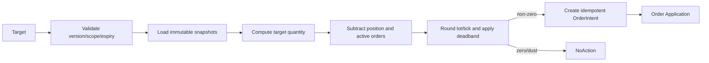

# Target Resolver

> Status: Proposed  
> TargetResolver 属于策略产品层与交易平台层之间的 Application Service。它把目标转为 OrderIntent，但不做最终风险批准。

## 输入

- 已批准格式的 TargetWeight/TargetPosition。
- 当前 Portfolio/Account Snapshot 及版本。
- 归属于目标 scope 的活动订单及预期影响。
- InstrumentSpec、交易日历、最新可用价格与质量。
- 策略 mandate、现金保留、最小交易金额和 lot/tick 规则。

## 计算

```text
TargetWeight:
target_value = allocatable_equity × target_weight
raw_target_quantity = target_value / reference_price
target_quantity = round_to_lot(raw_target_quantity, policy)

delta = target_quantity
      - current_attributed_quantity
      - active_order_expected_delta
```

TargetPosition 直接使用 target_quantity 后计算 delta。`active_order_expected_delta` 必须避免目标重复触发时重复下单。

## 流程



## 幂等

OrderIntent idempotency_key 由 `target_id + resolution_version + instrument_id + leg` 派生。相同快照和目标重复计算必须产生相同结果；快照版本变化产生新 resolution，但要继续扣除活动订单影响。

## 价格与取整

- reference_price 明确为 last/mid/VWAP/close 等策略，不得隐式选择。
- 行情 stale/invalid 时不生成扩大风险的 Intent。
- lot 取整默认向零，避免超过目标；剩余 dust 记录指标。
- 最小交易金额、费用和现金 buffer 在 resolver 阶段初筛，Risk 最终裁决。

## 部分成交与再求解

成交或订单终态变化触发重新求解，但必须去抖、限频并使用最新快照。已有订单活动时默认不生成同方向重复订单；可配置 amend/cancel-replace 策略，但必须走显式 Workflow。

## 输出审计

每次 resolution 记录 target_id、输入版本、公式参数、current/active/target/delta、取整、NoAction 原因和生成的 intent_id，以便回测与实盘解释一致。
