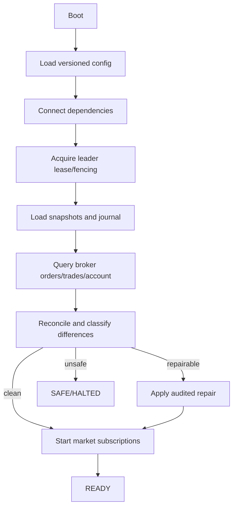

# 数据一致性、存储与恢复

> Status: Proposed

核心表、唯一约束及 Redis Stream 的规范性要求见 [Logical-Schema.md](Logical-Schema.md)。

## 权威来源矩阵

| 数据 | 权威来源 | 本地持久化 | 恢复方式 |
|---|---|---|---|
| 策略意图 | OMS Journal | PostgreSQL | Journal 重放 |
| 风控决策 | Risk Audit | PostgreSQL | 按 order_id 查询 |
| 外部委托状态 | Broker，OMS 保存观察历史 | PostgreSQL | Broker 查询 + 状态合并 |
| 成交 | Broker 成交回报/查询 | PostgreSQL 唯一约束 | 增量查询和去重 |
| 内部账本 | Account Ledger | PostgreSQL | 分录重放 + 快照 |
| 持仓/PnL | Ledger/Trade Projection | PostgreSQL + 内存 | 快照 + 增量重放 |
| 可用资金外部基线 | Broker Account | PostgreSQL 快照 | 启动及周期对账 |
| 风控配置 | Versioned Config Store | PostgreSQL | 按已激活版本加载 |
| 缓存/租约 | 非权威 | Redis | 丢弃重建 |

## PostgreSQL

保存订单 Journal、成交、账本、Outbox/Inbox、配置版本、审计记录和快照元数据。关键表使用业务唯一键、UTC 时间、schema 迁移和不可变审计列。数据库慢或不可用时，Trading Core 不得阻塞行情回调；若无法保证订单审计持久化，停止接受新订单。

## Redis

用于 Stream、短期缓存、限速计数和 Leader lease。Redis 数据可丢弃重建；不得把 Redis 中“最后状态”当作订单或资金最终事实。

## 快照

快照包含 aggregate_id、aggregate_version、schema_version、created_at 和 checksum。写入采用临时记录后原子发布；恢复必须验证 checksum 和版本。快照只是加速器，Journal 是可验证依据。

## 启动恢复

READY 前禁止新单。恢复期间收到的 Broker 回报先写入有界恢复缓冲并按来源序号/时间合并。

## 差异分类

- Missing Local：Broker 存在、本地缺失，导入并告警。
- Missing Broker：本地处于活动状态、Broker 不存在，进入 UNKNOWN，禁止盲目重发。
- Status Conflict：按合法状态迁移和 Broker 事实合并，保留原历史。
- Trade Missing/Duplicate：以业务唯一键补录/忽略重复。
- Position/Cash Difference：生成 reconciliation case，自动调整需阈值和审批策略。

## 事务边界

单个聚合状态和 Outbox 同一数据库事务；跨聚合采用 Saga/流程管理器和补偿，不使用跨服务分布式事务。任何外部 Broker 调用不得处于数据库事务内部。
