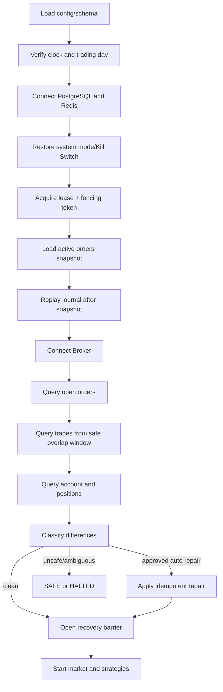

# Recovery Specification

> Status: Proposed  
> 恢复不是单个 `recover()` 函数，而是带屏障、证据和状态机的启动/重连流程。

## 恢复等级

| 等级 | 场景 | 目标 |
|---|---|---|
| R1 | Strategy Worker 重启 | 恢复 checkpoint，OMS 不受影响 |
| R2 | Projection Worker 重启 | Snapshot + Event replay 重建投影 |
| R3 | Broker/QMT 重连 | 补查订单、成交、资金、持仓后恢复 |
| R4 | Trading Core/OMS 重启 | 恢复 Journal、选主、Broker 对账 |
| R5 | Redis 丢失 | 重建 Stream 消费和缓存，永久事实不丢 |
| R6 | PostgreSQL 灾难 | PITR + Broker 补录 + 全量一致性验证 |

## OMS 冷启动

## 查询窗口

成交补查使用“上次确认 checkpoint 前移安全重叠窗口”，依靠 trade unique key 去重，不能只从最后时间戳精确开始。Broker 有分页/条数上限时必须循环到完整并校验页数和 checksum。

## 恢复期间消息

- Broker 回调立即持久化到 recovery inbox，再参与归并。
- 恢复快照与实时回调按 broker_sequence/业务不变量合并。
- Recovery barrier 打开前，Strategy 不得运行，OMS 不接受新 OrderIntent。
- 撤单/紧急控制是否允许由恢复阶段和证据明确决定，不能默认开放。

## 差异处置

| 差异 | 自动处置条件 | 否则 |
|---|---|---|
| Broker 有、本地无订单 | client_order_id 唯一关联且字段一致 | SUSPENDED + Case |
| 本地活动、Broker 查无 | 超过可见性窗口且多次一致查询 | UNKNOWN/SUSPENDED |
| 本地缺成交 | trade unique key 新且可关联 | 导入成交并记账 |
| 本地多成交 | Broker 多源查询确认不存在 | P0，禁止删除历史 |
| 持仓/资金差异 | 小额且有批准的调整策略 | 调整分录；否则 SAFE |
| 配置/交易日不一致 | 无 | HALTED，人工确认 |

## 恢复完成条件

- 活动订单均映射为确定状态或显式 SUSPENDED Case。
- 成交查询覆盖安全窗口且分页完整。
- Account/Position snapshot 为 FRESH，关键差异已关闭或批准隔离。
- Outbox、Inbox/PEL、投影 lag 在阈值内。
- 当前节点持有效 fencing token。
- 恢复报告持久化，包含输入版本、数量、差异、修复和 checksum。

## Strategy 恢复

策略 checkpoint 包含 strategy/version、state schema、last_event_position、parameter version、checksum。恢复后先进入 READY/PAUSED；只有行情、账户、组合和系统模式满足条件才进入 RUNNING。禁止为追赶历史行情而向真实 Broker 产生副作用。

## 灾难恢复

PostgreSQL PITR 后必须从恢复点到当前执行 Broker 成交补录，并重建 Ledger/Projection。若审计 RPO=0 无法被现有部署证明，系统不得对外宣称 RPO=0；以演练实测值更新 SLO。
