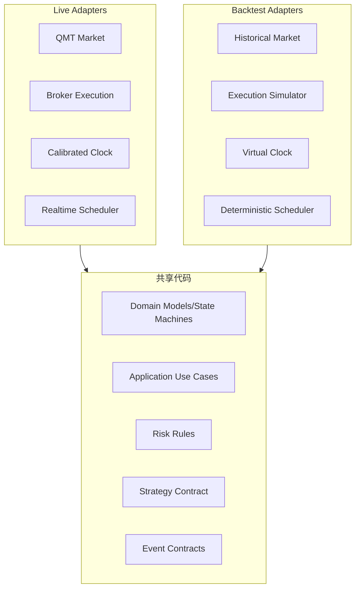

# Backtest 与 Live 统一架构

> Status: Proposed

## 统一边界

共享交易语义和状态机，不共享错误假设。Live 具有网络延迟、未知提交状态、断连与异步回报；Backtest 必须由 Simulator 显式建模成交、滑点、费用、涨跌停、停牌、交易时段、部分成交和延迟。

## 确定性

- 相同输入数据、配置版本、随机种子和代码版本必须得到相同结果。
- VirtualClock 是唯一时间来源；禁止读取 `datetime.now()`。
- 同时间戳事件使用稳定优先级和序号排序。
- 结果记录数据集版本、策略版本、规则版本、参数、费用模型和 Git commit（若存在）。

## 历史行情

数据进入回测前执行 schema、交易日历、复权、重复、缺失和单调性检查。原始价格、复权价格和可交易价格不得混用；缺失数据不能默认前值填充后继续交易。

Mini QMT 可以是历史数据来源，但只能在运行前完成下载/导出和受控 ingestion。数据必须
冻结为包含 dataset/partition version、availability policy 与 checksum 的不可变 manifest；
回测运行期间不得再次读取变化中的 Mini QMT 数据。Historical Market 只能释放
`available_at <= VirtualClock` 的事实，防止未来数据泄漏。

回测与 Mini QMT 模拟实盘共享 Strategy artifact、OrderIntent、TargetResolver、OMS、
Risk、Execution request、Ledger/Portfolio 和审计语义；不共享外部假设。回测使用
VirtualClock、Deterministic Scheduler 和 Execution Simulator，模拟实盘保留网络延迟、
断连、异步回报和 UNKNOWN/reconciliation。

## 模拟执行

Simulator 接收与 Live Execution 相同的命令契约，输出相同的 BrokerReport 契约。禁止策略访问未来 Bar、当根 Bar 完整 OHLC 或尚未发生的成交量。成交模型必须声明流动性上限和撮合时点。

## 指标

收益指标之外必须输出成交率、撤单率、换手、容量、暴露、滑点、费用、最大回撤持续时间和数据质量告警。回测结果不是生产准入；策略上线还需仿真、Paper Trading、限额实盘和回滚方案。
