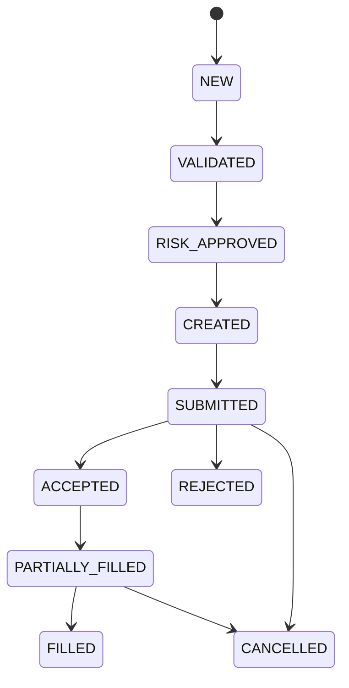
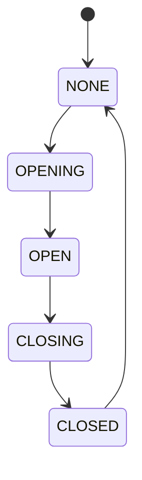
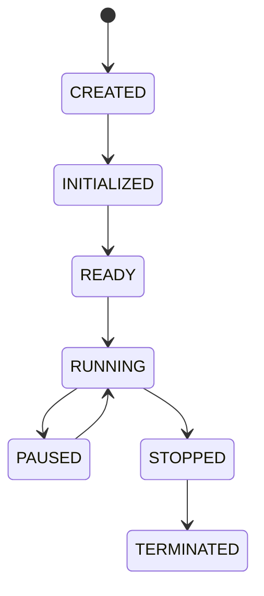
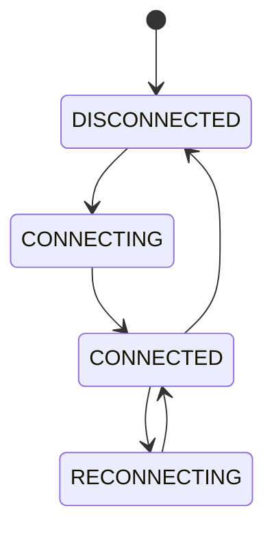

# ADR-0005：采用 State Machine Driven Architecture（状态机驱动架构）
| 属性 | 内容 |
| --- | --- |
| ADR 编号 | ADR-0005 |
| 标题 | Adopt State Machine Driven Architecture |
| 状态 | Accepted |
| 日期 | 2026-06-30 |
| 决策者 | quantiqmt Architecture Team |


---

# 1. Context（背景）
交易系统中的所有核心业务对象都具有生命周期（Lifecycle）。

例如：

订单：

```plain
创建

↓

风控

↓

发送

↓

交易所受理

↓

部分成交

↓

全部成交
```

Broker：

```plain
断开

↓

连接

↓

重连

↓

恢复
```

策略：

```plain
初始化

↓

启动

↓

暂停

↓

停止
```

持仓：

```plain
空仓

↓

建仓

↓

持仓

↓

平仓
```

这些对象并不是静态数据。

而是具有严格生命周期的业务对象。

因此，需要一种能够准确描述生命周期的软件模型。

---

# 2. Problem Statement（问题）
很多量化框架：

直接：

```plain
order.status = "filled"
```

或者：

```plain
position.volume += 100
```

这种方式存在严重问题。

---

## 状态跳跃
例如：

订单：

```plain
NEW
```

直接：

```plain
FILLED
```

中间：

没有：

```plain
SUBMITTED

ACCEPTED
```

业务错误。

无法发现。

---

## 非法状态
例如：

```plain
CANCELLED
```

以后：

又：

```plain
FILLED
```

完全非法。

代码：

无法限制。

---

## 状态散落
大量：

```plain
if status == xx
```

最终：

整个项目：

充满：

Magic String。

---

## 生命周期不可追踪
不知道：

订单：

什么时候：

变成：

FILLED。

也不知道：

为什么。

无法审计。

---

# 3. Decision（架构决策）
整个系统采用：

State Machine Driven Architecture。

所有具有生命周期的业务对象：

必须：

由状态机管理。

禁止：

直接修改状态。

状态：

只能：

通过：

State Transition。

完成。

---

# 4. Scope（适用范围）
以下对象：

必须采用状态机：

| 对象 | 是否必须 |
| --- | --- |
| Order | ✅ |
| Trade | ✅（有限状态） |
| Position | ✅ |
| Portfolio | ✅ |
| Strategy | ✅ |
| Broker Connection | ✅ |
| Market Subscription | ✅ |
| Gateway | ✅ |
| Application Lifecycle | ✅ |


禁止：

新增：

生命周期对象：

而不建立状态机。

---

# 5. Core Principles（核心原则）
## Principle 1：State is Immutable
状态：

不能：

直接修改。

禁止：

```python
order.status = FILLED
```

必须：

```plain
OrderStateMachine

↓

transition()
```

---

## Principle 2：Transition Only
状态：

只能：

发生：

合法迁移。

例如：

```plain
NEW

↓

VALIDATED

↓

RISK_APPROVED

↓

SUBMITTED
```

禁止：

```plain
NEW

↓

FILLED
```

---

## Principle 3：Transition Generates Event
任何状态变化：

必须：

发布：

Event。

例如：

```plain
NEW

↓

VALIDATED

↓

OrderValidatedEvent
```

以后：

所有模块：

统一：

消费：

Event。

---

## Principle 4：No Hidden State
任何状态：

必须：

可见。

Dashboard：

能够：

实时展示。

---

# 6. Order State Machine
订单生命周期如下：



所有订单：

必须：

遵守。

---

# 7. Position State Machine


Position：

不能：

直接：

删除。

---

# 8. Strategy State Machine


任何 Strategy：

统一生命周期。

---

# 9. Connection State Machine


所有 Gateway：

统一状态。

---

# 10. Application Lifecycle
整个系统：

生命周期：

```plain
Boot

↓

Loading Config

↓

Initializing

↓

Recovering

↓

Ready

↓

Trading

↓

Stopping

↓

Stopped
```

Application：

也属于：

状态机。

---

# 11. State Transition Rules
状态迁移：

必须：

满足：

以下原则：

+ 单向迁移
+ 可验证
+ 可审计
+ 可回放
+ 可恢复

任何状态：

必须：

记录：

```plain
Old State

↓

New State

↓

Timestamp

↓

Reason

↓

EventID
```

---

# 12. State Persistence
状态：

必须：

可恢复。

例如：

OMS：

恢复：

```plain
Order

↓

Current State

↓

Resume
```

Broker：

恢复：

```plain
CONNECTED
```

以后：

继续：

运行。

---

# 13. Consequences（影响）
采用状态机后：

优点：

+ 生命周期清晰
+ 禁止非法状态
+ 易于恢复
+ 易于 Replay
+ 易于 Debug
+ 易于测试
+ 易于可视化
+ 易于监控

缺点：

+ 初期实现复杂
+ 每个对象需要状态图
+ 状态迁移需要严格维护

这些成本可以接受。

---

# 14. Alternatives Considered（备选方案）
## Status 字段
未采用。

原因：

无法限制：

非法状态。

---

## Enum + if
未采用。

原因：

状态逻辑：

分散。

最终：

大量：

```plain
if status ==
```

---

## 无状态
未采用。

原因：

交易系统：

天然：

就是：

生命周期系统。

---

# 15. Implementation Constraints（实现约束）
所有生命周期对象：

必须：

实现：

State Machine。

禁止：

```plain
entity.status =
```

所有状态变化：

必须：

通过：

```plain
transition()
```

所有状态变化：

必须：

发布：

StateChangedEvent。

任何新增生命周期对象：

必须：

新增：

State Diagram。

---

# 16. References
+ Martin Fowler — State Machine
+ Enterprise Integration Patterns
+ UML State Machine Specification
+ FIX Protocol Order State Model
+ NASDAQ OMS Design

## 17 .State Machine Ownership（状态机所有权）
明确规定：

+  每个聚合根（Aggregate Root）拥有自己的状态机。 
+  只有聚合根可以驱动状态迁移。 
+  外部模块不能直接修改聚合根状态。 

例如：

+ `Order` 只能由 OMS 驱动状态迁移。 
+ `Portfolio` 只能由 Portfolio Context 更新。 
+ `Account` 只能由 Account Context 更新。 

这样可以彻底避免跨 Context 修改状态。

---

## 18.Transition Guards（迁移守卫）
规定每次状态迁移前必须进行 Guard 检查，例如：

```plain
NEW
    │
    ├── Order 已通过校验？
    ├── 风控已批准？
    ├── Account 可用资金充足？
    └── Broker 已连接？
```

只有全部通过，才允许进入下一状态。

Guard 是状态机的一部分，而不是业务代码里的 `if`。

---

## 19 .Transition Actions（迁移动作）
规定状态迁移不仅改变状态，还可以触发动作，例如：

+  发布 Domain Event 
+  更新聚合内部数据 
+  写审计日志 
+  更新指标（Metrics） 
+  通知 Dashboard 

这样状态机就成为整个系统行为的统一入口。

---

## 20 .State Recovery（状态恢复）
规定系统重启时如何恢复状态：

```plain
Boot
    ↓
Recover Aggregate
    ↓
Recover Current State
    ↓
Validate State
    ↓
Resume State Machine
```

恢复后继续运行，而不是重新初始化。

